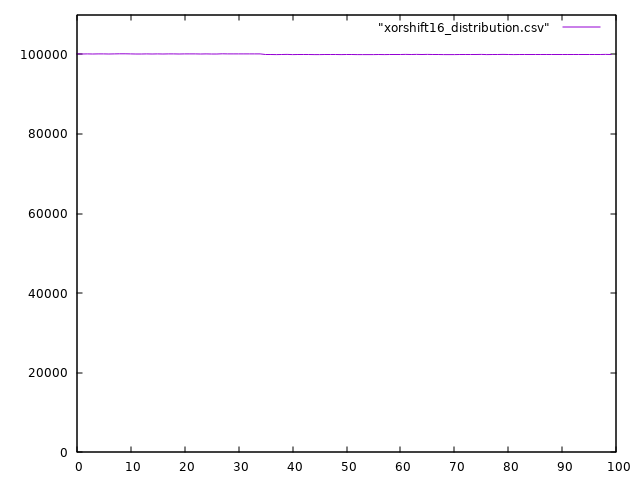

# A PRNG comparison [WiP]
A comparison of simple and fast psudo-random number generators

Been looking for a fast and possibly unbiased pseudo-random number generator for a video game, so I decided to check out a few alternatives. The generated numbers must be in a range of [0,N) with N relatively small, usually not exceeding 10.000, so 16 bit are more than sufficient. Speed is favored over quality as long as the output looks random enough to a casual observer. Having the numbers distributed evenly throughout the range would be a nice addition but we can live with a slightly biased output.

The algorithms considered are the following:

* Lemire: a fast 16 bit random number generator by Daniel Lemire [1];
* xorshift16: a 16 bit version of the Xorshift generator [2];
* LCG: a linear congruential generator [3] with MSVC parameters;
* standard: the standard C rand() function.

## Output

[_TODO: add some details_]


## Distribution

[_TODO: add some details_]





## Timings

The test program has been compiled with gcc version 10.3.1 

`g++ -O3 testPRNG.cpp`

The test has been run on an AMD FX(tm)-6300

Results:
```
Lemire: time elapsed: 0.0454349 seconds
xorshift16: time elapsed: 0.0659807 seconds
LCG: time elapsed: 0.0535795 seconds
standard: time elapsed: 0.332941 seconds
```
## References

[1] https://lemire.me/blog/2019/07/03/a-fast-16-bit-random-number-generator/  
[2] https://en.wikipedia.org/wiki/Xorshift  
[3] https://en.wikipedia.org/wiki/Linear_congruential_generator  
